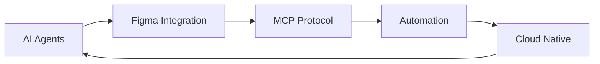
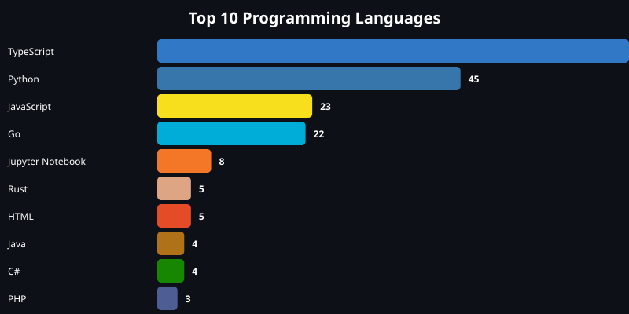
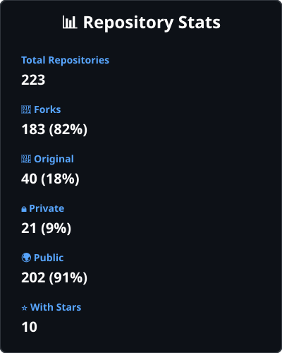
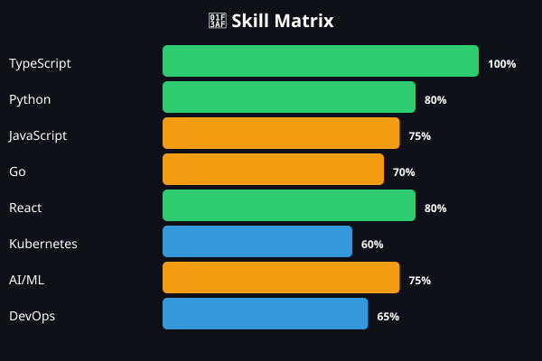

<div align="center">

# 👋 Hi, I'm Josefo (@jozrftamson)

### 🤖 AI Engineer | ☸️ Cloud Native Enthusiast | 🎨 Design-Tech Bridge Builder

[](https://github.com/jozrftamson)
[](https://github.com/jozrftamson)

</div>

---

## 🚀 About Me

```typescript
const josefo = {
    location: "🌍 Germany",
    currentFocus: ["AI Agents", "Figma Integration", "Cloud Native"],
    learning: ["Kubernetes", "MCP Protocol", "Advanced TypeScript"],
    languages: ["TypeScript", "Python", "Go", "JavaScript"],
    interests: ["AI/ML", "DevOps", "Full-Stack Development", "Design Systems"],
    funFact: "I bridge the gap between design and AI automation 🎨🤖"
};
```

---

## 🛠️ Tech Stack

<div align="center">

### Languages


### Frontend


### Backend & Cloud


### AI & Tools


</div>

---

## 🎯 Current Projects

### 🔥 Featured

<table>
<tr>
<td width="50%">

#### 🤖 [figma-mcp](https://github.com/jozrftamson/figma-mcp)
Figma MCP Server - Model Context Protocol integration for Figma API with Hermes AI Agent

**Tech:** Python, MCP, Figma API

</td>
<td width="50%">

#### 🎨 [hermes-figma-prompt-hub](https://github.com/jozrftamson/hermes-figma-prompt-hub)
Figma-to-MCP prompt management for Hermes workflows

**Tech:** Python, Figma, AI Agents

</td>
</tr>
<tr>
<td width="50%">

#### 🔄 [notion-sync](https://github.com/jozrftamson/notion-sync)
Automatic synchronization tool for Notion with local development environments

**Tech:** JavaScript, Notion API

</td>
<td width="50%">

#### 🌐 [SynapseNet](https://github.com/jozrftamson/SynapseNet)
Modular AI Agent Network for connecting Business & Personal APIs

**Tech:** Multi-language, AI Orchestration

</td>
</tr>
</table>

---

## 📊 GitHub Stats

<div align="center">


</div>

---

## 🎨 What I'm Working On



### 🔭 Current Focus Areas

- 🤖 **AI Agent Development** - Building intelligent automation systems
- 🎨 **Design-to-Code** - Bridging Figma and AI workflows
- ☸️ **Cloud Native** - Kubernetes and container orchestration
- 🔄 **Automation** - Streamlining development workflows
- 📊 **Data Engineering** - Building robust data pipelines

---

## 🌱 Learning Journey

<div align="center">

| Area | Status | Next Steps |
|------|--------|------------|
| 🤖 AI Agents | 🟢 Active | Advanced MCP integration |
| ☸️ Kubernetes | 🟡 Learning | Operator development |
| 🎨 Figma API | 🟢 Active | Plugin development |
| 🔐 Security | 🟡 Learning | Cloud security best practices |

</div>

---

## 💼 Open to Collaborate On

- 🤖 AI Agent frameworks and tools
- 🎨 Design system automation
- ☸️ Cloud-native applications
- 🔄 Developer productivity tools
- 📊 Data engineering projects

---

## 📫 How to Reach Me

<div align="center">

[](https://github.com/jozrftamson)
[](https://linkedin.com/in/yourprofile)
[](mailto:your.email@example.com)

</div>

---

## 📈 Contribution Graph

<div align="center">


</div>

---

## 🏆 Achievements

<div align="center">


</div>

---

## 💡 Fun Facts

- 🎯 I love connecting design tools with AI automation
- 🌍 Multilingual developer (20+ programming languages)
- 🚀 Active contributor to open-source projects
- 📚 Continuous learner and technology enthusiast
- 🎨 Passionate about bridging design and development

---

<div align="center">

### 💭 Quote of the Day


---

### 👀 Profile Views


---

**⭐ From [jozrftamson](https://github.com/jozrftamson)**

*"Building the future, one commit at a time"* 🚀

</div>

---


## 📊 Live Statistics

**Last Updated:** 2026-08-11 03:26:20 (Berlin Time)

- 📦 Total Repositories: **204**
- 🔱 Forks: **184** (90.2%)
- 💎 Original: **20** (9.8%)
- ⭐ Total Stars: **20**
- 🔒 Private: **0**
- 🌍 Public: **204**
## 📊 Visual Analytics

<div align="center">

### Programming Languages Distribution


### Project Categories


### Repository Statistics


### Skill Matrix


</div>

---

## 📈 Detailed Analysis

For a comprehensive analysis of this GitHub account, see:
- [Complete Analysis Report](./GITHUB_ACCOUNT_COMPLETE_ANALYSIS.md)
- [Visual Summary](./VISUAL_SUMMARY.md)
- [Account Analysis](./ACCOUNT_ANALYSIS_REPORT.md)

